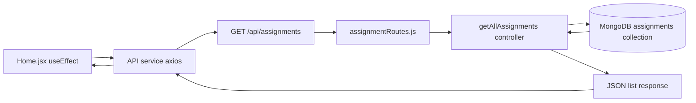
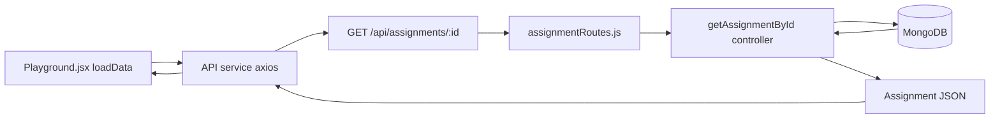
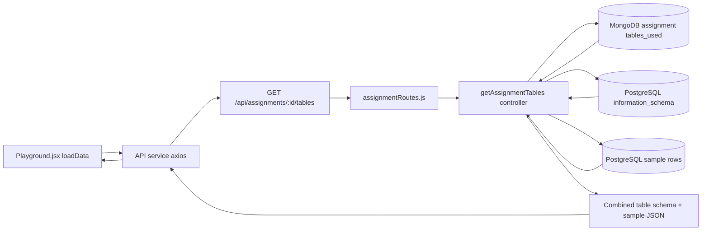
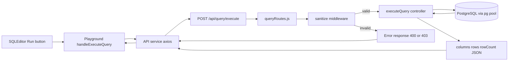
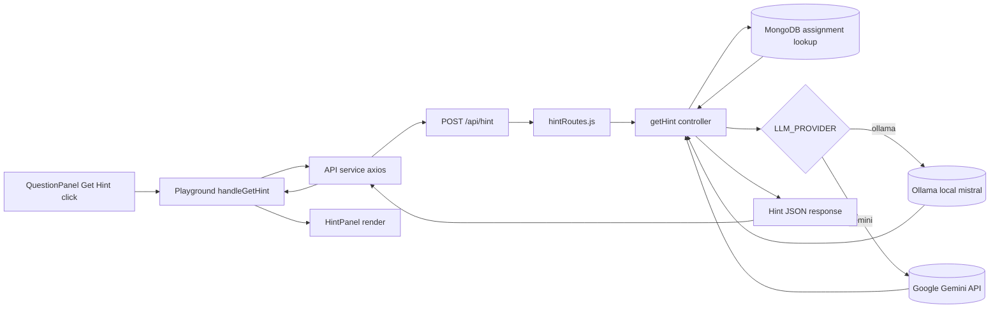

# How I Built CipherSQLStudio — Complete Learning Guide

This document explains **every single file** in this project, what it does, why it exists, and how it connects to everything else. Read this top to bottom and you'll understand the full architecture.

---

## Table of Contents

1. [The Big Picture](#1-the-big-picture)
2. [How a Web App Works (Quick Refresher)](#2-how-a-web-app-works)
3. [Project Folder Structure](#3-project-folder-structure)
4. [Backend — Step by Step](#4-backend--step-by-step)
   - 4.1 [Entry Point: server.js](#41-entry-point-serverjs)
   - 4.2 [Config: Database Connections](#42-config-database-connections)
   - 4.3 [Models: Data Shapes](#43-models-data-shapes)
   - 4.4 [Middleware: SQL Sanitization](#44-middleware-sql-sanitization)
   - 4.5 [Controllers: Business Logic](#45-controllers-business-logic)
   - 4.6 [Routes: URL Mapping](#46-routes-url-mapping)
   - 4.7 [Seed Scripts: Sample Data](#47-seed-scripts-sample-data)
5. [Frontend — Step by Step](#5-frontend--step-by-step)
   - 5.1 [SCSS Architecture](#51-scss-architecture)
   - 5.2 [API Service Layer](#52-api-service-layer)
   - 5.3 [App.jsx and Routing](#53-appjsx-and-routing)
   - 5.4 [Home Page](#54-home-page)
   - 5.5 [Playground Page](#55-playground-page)
   - 5.6 [Each Component Explained](#56-each-component-explained)
6. [How Data Flows Through the App](#6-how-data-flows-through-the-app)
7. [Key Concepts to Understand](#7-key-concepts-to-understand)
8. [Complete API Endpoint Deep Dive](#8-complete-api-endpoint-deep-dive)
  - 8.1 [GET /api/health](#81-get-apihealth)
  - 8.2 [GET /api/assignments](#82-get-apiassignments)
  - 8.3 [GET /api/assignments/:id](#83-get-apiassignmentsid)
  - 8.4 [GET /api/assignments/:id/tables](#84-get-apiassignmentsidtables)
  - 8.5 [POST /api/query/execute](#85-post-apiqueryexecute)
  - 8.6 [POST /api/hint](#86-post-apihint)

---

## 1. The Big Picture

This app has 3 main pieces talking to each other:

```
┌─────────────┐        ┌──────────────┐        ┌────────────────┐
│   Browser   │  HTTP  │   Express    │        │  PostgreSQL    │
│   (React)   │◄─────►│   Server     │◄──────►│  (SQL sandbox) │
│             │        │   (Node.js)  │        │                │
└─────────────┘        │              │        └────────────────┘
                       │              │        ┌────────────────┐
                       │              │◄──────►│   MongoDB      │
                       │              │        │  (assignments) │
                       │              │        └────────────────┘
                       │              │        ┌────────────────┐
                       │              │───────►│ Gemini API     │
                       │              │        │ (optional LLM) │
                       │              │        └────────────────┘
                       │              │        ┌────────────────┐
                       │              │◄──────►│ Ollama (local) │
                       │              │        │ (mistral hints)│
                       └──────────────┘        └────────────────┘
```

- **React (Frontend)**: What the user sees and interacts with. Runs in the browser.
- **Express (Backend)**: Receives requests from the frontend, talks to databases, and returns data.
- **PostgreSQL**: Stores the actual SQL tables (employees, orders, etc.) that students write queries against.
- **MongoDB**: Stores assignment metadata (title, description, difficulty, which tables are used).
- **Ollama (Mistral)**: Local AI option for generating hints without a cloud API key.
- **Gemini API**: Optional cloud AI option for generating hints when enabled.

**Why two databases?**
- PostgreSQL is the SQL practice sandbox. Students write real SELECT queries, and those run on real relational tables.
- MongoDB stores app metadata like assignment title, difficulty, and table mapping in document form.
- Separation keeps risk low: student SQL never runs on metadata storage.
- Separation also improves flexibility: assignment content can evolve quickly without SQL migrations, while SQL exercises stay relational and realistic.

**Interview answer (short version):**
- We used PostgreSQL for execution because the core feature is SQL learning on relational data.
- We used MongoDB for content management because assignments are document-like metadata and easier to update independently.
- This hybrid design gives realism for SQL practice and agility for app content.

---

## 2. How a Web App Works

If you're new to full-stack, here's the basic flow:

1. User opens `http://localhost:5173` in browser
2. Browser loads the React app (HTML + JS + CSS)
3. React app renders the UI
4. When user clicks something (like "Run Query"):
   - React sends an HTTP request (using `axios`) to `http://localhost:5000/api/query/execute`
   - Express server receives the request
   - Server processes it (validates query, runs it on PostgreSQL)
   - Server sends back a JSON response
   - React receives the response and updates the UI

That's it. Everything is **request → response**. The frontend asks, the backend answers.

---

## 3. Project Folder Structure

```
CipherSQLStudio/
│
├── server/                          # BACKEND
│   ├── server.js                    # Entry point — starts everything
│   ├── config/
│   │   ├── db.js                    # MongoDB connection function
│   │   └── pgPool.js               # PostgreSQL connection pool
│   ├── models/
│   │   ├── Assignment.js            # Mongoose schema for assignments
│   │   └── Attempt.js               # Mongoose schema for saved attempts
│   ├── middleware/
│   │   └── sanitize.js              # Checks SQL queries are safe
│   ├── controllers/
│   │   ├── assignmentController.js  # Handles assignment-related requests
│   │   ├── queryController.js       # Handles SQL execution requests
│   │   └── hintController.js        # Handles LLM hint generation
│   ├── routes/
│   │   ├── assignmentRoutes.js      # Maps URL paths to assignment controller
│   │   ├── queryRoutes.js           # Maps URL paths to query controller
│   │   └── hintRoutes.js            # Maps URL paths to hint controller
│   ├── seed/
│   │   ├── seedPostgres.js          # Creates tables + inserts data in PostgreSQL
│   │   └── seedAssignments.js       # Inserts assignment documents in MongoDB
│   ├── .env                         # Your secret keys (never commit this)
│   └── .env.example                 # Template showing what keys are needed
│
├── client/                          # FRONTEND
│   ├── src/
│   │   ├── main.jsx                 # React entry point — mounts App
│   │   ├── App.jsx                  # Routing setup (which URL shows which page)
│   │   ├── services/
│   │   │   └── api.js               # Axios instance for making API calls
│   │   ├── styles/
│   │   │   ├── _variables.scss      # Colors, breakpoints, spacing values
│   │   │   ├── _mixins.scss         # Reusable SCSS functions
│   │   │   ├── _reset.scss          # CSS reset for consistency
│   │   │   ├── _typography.scss     # Heading and text styles
│   │   │   └── main.scss            # Imports all the above
│   │   ├── pages/
│   │   │   ├── Home/                # Assignment listing page
│   │   │   └── Playground/          # SQL editor + results page
│   │   └── components/
│   │       ├── Header/              # Top navigation bar
│   │       ├── AssignmentCard/      # Card for each assignment
│   │       ├── DifficultyBadge/     # Easy/Medium/Hard badge
│   │       ├── QuestionPanel/       # Shows assignment question + hint button
│   │       ├── SchemaViewer/        # Shows table columns and sample data
│   │       ├── SQLEditor/           # Monaco code editor for SQL
│   │       ├── ResultsTable/        # Displays query results
│   │       └── HintPanel/           # Shows the LLM-generated hint
│   ├── .env                         # Frontend environment variables
│   └── .env.example                 # Template for frontend env
│
└── README.md                        # Setup instructions
```

**Why this structure?**

This follows the **separation of concerns** principle:
- `config/` = how we connect to things
- `models/` = what our data looks like
- `middleware/` = processing that happens before the controller
- `controllers/` = the actual logic (what to do with the request)
- `routes/` = which controller handles which URL
- `components/` = small reusable UI pieces
- `pages/` = full page layouts that use components

---

## 4. Backend — Step by Step

### 4.1 Entry Point: server.js

This is where the app starts when you run `npm run dev`.

```javascript
const express = require('express');
const cors = require('cors');
const morgan = require('morgan');
const dotenv = require('dotenv');
const connectDB = require('./config/db');

dotenv.config();

const app = express();

app.use(cors());
app.use(express.json());
app.use(morgan('dev'));

const assignmentRoutes = require('./routes/assignmentRoutes');
const queryRoutes = require('./routes/queryRoutes');
const hintRoutes = require('./routes/hintRoutes');

app.use('/api/assignments', assignmentRoutes);
app.use('/api/query', queryRoutes);
app.use('/api/hint', hintRoutes);

app.get('/api/health', (req, res) => {
  res.json({ status: 'ok', message: 'CipherSQLStudio API is running' });
});

const PORT = process.env.PORT || 5000;

connectDB().then(() => {
  app.listen(PORT, () => {
    console.log(`Server running on port ${PORT}`);
  });
});
```

**Line by line:**

1. **`require('express')`** — Imports Express, a web framework for Node.js. It handles HTTP requests.

2. **`require('cors')`** — CORS (Cross-Origin Resource Sharing). Our frontend runs on port 5173 and backend on port 5000. Browsers block requests between different ports by default. `cors()` tells the browser "it's okay, allow requests from the frontend."

3. **`require('morgan')`** — A logging middleware. It prints every incoming request in the terminal like `GET /api/assignments 200 15ms`. Helpful for debugging.

4. **`dotenv.config()`** — Loads variables from the `.env` file into `process.env`. This is how we keep secrets (database passwords, API keys) out of our code.

5. **`app.use(cors())`** — Tells Express to use CORS middleware on every request.

6. **`app.use(express.json())`** — Tells Express to automatically parse JSON request bodies. When the frontend sends `{ query: "SELECT * FROM employees" }`, this middleware parses it into a JavaScript object so we can access `req.body.query`.

7. **`app.use('/api/assignments', assignmentRoutes)`** — Any request starting with `/api/assignments` gets handled by the assignment routes file. This is called "mounting" routes.

8. **`connectDB().then(...)`** — First connect to MongoDB, then start the server. We use `.then()` because connecting to a database is asynchronous (takes time).

---

### 4.2 Config: Database Connections

#### db.js (MongoDB)

```javascript
const mongoose = require('mongoose');

const connectDB = async () => {
  try {
    const conn = await mongoose.connect(process.env.MONGO_URI);
    console.log(`MongoDB connected: ${conn.connection.host}`);
  } catch (err) {
    console.error('MongoDB connection error:', err.message);
    process.exit(1);
  }
};

module.exports = connectDB;
```

**What's happening:**
- `mongoose` is an ODM (Object Data Modeling) library for MongoDB. It gives us a nice way to define data shapes (schemas) and interact with MongoDB using JavaScript.
- `mongoose.connect()` takes the connection string from `.env` and opens a connection.
- If connection fails, we call `process.exit(1)` — this crashes the server on purpose. No point running if we can't talk to the database.
- We export this function so `server.js` can call it.

#### pgPool.js (PostgreSQL)

```javascript
const { Pool } = require('pg');

const pool = new Pool({
  host: process.env.PG_HOST,
  port: parseInt(process.env.PG_PORT, 10),
  user: process.env.PG_USER,
  password: process.env.PG_PASSWORD,
  database: process.env.PG_DATABASE,
});

pool.on('error', (err) => {
  console.error('Unexpected PostgreSQL pool error:', err);
});

module.exports = pool;
```

**What's happening:**
- `pg` is the PostgreSQL client for Node.js.
- A **Pool** manages multiple database connections. Instead of opening/closing a connection for every query, the pool keeps connections ready. When a query comes in, it grabs an available connection, uses it, then returns it to the pool.
- `parseInt(process.env.PG_PORT, 10)` — Environment variables are always strings. PostgreSQL needs the port as a number, so we parse it.
- `pool.on('error', ...)` — Catches unexpected errors on idle connections so they don't crash the whole server.

**Why Pool instead of a single Client?**
If 10 students click "Run Query" at the same time, a single connection would queue them one by one. A pool can handle multiple queries simultaneously using different connections.

---

### 4.3 Models: Data Shapes

#### Assignment.js (Mongoose Model)

```javascript
const mongoose = require('mongoose');

const assignmentSchema = new mongoose.Schema({
  title: {
    type: String,
    required: true,
    trim: true,
  },
  description: {
    type: String,
    required: true,
  },
  difficulty: {
    type: String,
    enum: ['Easy', 'Medium', 'Hard'],
    default: 'Easy',
  },
  tables_used: {
    type: [String],
    required: true,
  },
  expected_hint: {
    type: String,
    default: '',
  },
  created_at: {
    type: Date,
    default: Date.now,
  },
});

module.exports = mongoose.model('Assignment', assignmentSchema);
```

**What's happening:**
- A **schema** defines the shape of documents in a MongoDB collection. Think of it like a blueprint.
- `type: String` — This field must be a string.
- `required: true` — Can't save a document without this field.
- `trim: true` — Automatically removes whitespace from the beginning and end.
- `enum: ['Easy', 'Medium', 'Hard']` — Only allows these 3 values. Anything else gets rejected.
- `type: [String]` — An array of strings. For `tables_used`, this would be like `['employees', 'departments']`.
- `default: Date.now` — If no date is provided, automatically use the current time.
- `mongoose.model('Assignment', assignmentSchema)` — Creates a model from the schema. The model gives us methods like `.find()`, `.findById()`, `.insertMany()` to interact with the MongoDB collection. MongoDB will create a collection called `assignments` (lowercase, plural).

#### Attempt.js (Mongoose Model)

Same idea, but for storing student query attempts. Has `assignment_id` which references an Assignment document.

---

### 4.4 Middleware: SQL Sanitization

This is **critical for security**. Without this, a student could run `DROP TABLE employees` and destroy the data.

```javascript
const BLOCKED_KEYWORDS = [
  'INSERT', 'UPDATE', 'DELETE', 'DROP', 'ALTER',
  'TRUNCATE', 'CREATE', 'GRANT', 'REVOKE', 'EXEC',
  'EXECUTE', 'COPY',
];

function sanitizeQuery(req, res, next) {
  const { query } = req.body;

  // Check 1: query must exist and be a string
  if (!query || typeof query !== 'string') {
    return res.status(400).json({
      success: false,
      error: 'Query is required and must be a string.',
    });
  }

  const trimmed = query.trim();

  // Check 2: not empty
  if (trimmed.length === 0) {
    return res.status(400).json({...});
  }

  // Check 3: must start with SELECT
  if (!/^SELECT\b/i.test(trimmed)) {
    return res.status(403).json({
      success: false,
      error: 'Only SELECT queries are allowed.',
    });
  }

  // Check 4: no blocked keywords
  for (const keyword of BLOCKED_KEYWORDS) {
    const pattern = new RegExp('\\b' + keyword + '\\b', 'i');
    if (pattern.test(trimmed.toUpperCase())) {
      return res.status(403).json({
        success: false,
        error: `Queries containing "${keyword}" are not allowed.`,
      });
    }
  }

  // Check 5: no chained statements with semicolons
  // ...

  req.cleanQuery = trimmed.replace(/;\s*$/, '');
  next();
}
```

**How middleware works:**

Middleware is a function that sits between the request and the controller. The flow is:

```
Request → sanitizeQuery() → queryController.executeQuery()
```

- If `sanitizeQuery` finds a problem, it sends an error response and **never calls `next()`**. The controller never runs.
- If the query is safe, it calls `next()` which passes control to the next function (the controller).
- We attach the cleaned query to `req.cleanQuery` so the controller can use it.

**Why `\b` in the regex?**
`\b` means "word boundary". Without it, the word `DELETE` would also match column names like `IS_DELETED`. With `\b`, it only matches the standalone keyword.

**Why block semicolons?**
A semicolon separates SQL statements. Without this check, someone could write: `SELECT 1; DROP TABLE employees` — the first part passes our SELECT check, but the second part destroys data.

---

### 4.5 Controllers: Business Logic

#### assignmentController.js

```javascript
async function getAllAssignments(req, res) {
  try {
    const assignments = await Assignment.find().sort({ created_at: -1 });
    res.json({ success: true, data: assignments });
  } catch (err) {
    console.error('Error fetching assignments:', err);
    res.status(500).json({ success: false, error: 'Failed to load assignments.' });
  }
}
```

**What's happening:**
- `Assignment.find()` — Mongoose method that fetches ALL documents from the assignments collection.
- `.sort({ created_at: -1 })` — Sort by creation date, newest first. `-1` means descending.
- `res.json({...})` — Sends JSON response back to the frontend.
- We always wrap in `try/catch` because database operations can fail (network issues, etc.).
- We use a consistent response format: `{ success: true/false, data/error: ... }`. This makes it easy for the frontend to check `if (response.data.success)`.

#### getAssignmentTables — The Interesting One

```javascript
async function getAssignmentTables(req, res) {
  const assignment = await Assignment.findById(req.params.id);
  
  const tablesInfo = [];
  for (const tableName of assignment.tables_used) {
    // Get column info
    const schemaResult = await pool.query(
      `SELECT column_name, data_type
       FROM information_schema.columns
       WHERE table_name = $1
       ORDER BY ordinal_position`,
      [tableName]
    );

    // Get sample rows
    const sampleResult = await pool.query(
      `SELECT * FROM ${tableName} LIMIT 5`
    );

    tablesInfo.push({
      table_name: tableName,
      columns: schemaResult.rows,
      sample_data: sampleResult.rows,
    });
  }

  res.json({ success: true, data: tablesInfo });
}
```

**What's happening:**
- First, we get the assignment from MongoDB to know which PostgreSQL tables it uses.
- `information_schema.columns` is a built-in PostgreSQL system table that contains info about every column in every table. We query it to get column names and data types.
- `$1` is a **parameterized query** — PostgreSQL replaces `$1` with the first value in the array `[tableName]`. This prevents SQL injection.
- We grab 5 sample rows so students can see what the data looks like before writing their query.
- The response combines both MongoDB data (assignment info) and PostgreSQL data (table schema + samples).

#### queryController.js

```javascript
async function executeQuery(req, res) {
  const query = req.cleanQuery; // set by sanitize middleware

  const client = await pool.connect();
  try {
    await client.query('SET statement_timeout = 5000'); // 5 seconds max
    const result = await client.query(query);

    const columns = result.fields.map((f) => f.name);

    res.json({
      success: true,
      columns: columns,
      rows: result.rows,
      rowCount: result.rowCount,
    });
  } finally {
    client.release();
  }
}
```

**What's happening:**
- `pool.connect()` — Grabs a connection from the pool.
- `SET statement_timeout = 5000` — Tells PostgreSQL to cancel any query that takes longer than 5 seconds. This prevents a student from accidentally running a query that takes forever.
- `result.fields` — PostgreSQL returns metadata about the columns. We extract just the names.
- `result.rows` — The actual data rows as an array of objects.
- `client.release()` — **Critical!** Returns the connection back to the pool. If we forget this, the pool runs out of connections and the server stops working. The `finally` block ensures this runs even if there's an error.

#### hintController.js

```javascript
async function getHint(req, res) {
  const { assignmentId, userQuery } = req.body;

  const assignment = await Assignment.findById(assignmentId);

  const genAI = new GoogleGenerativeAI(apiKey);
  const model = genAI.getGenerativeModel({ model: 'gemini-2.0-flash' });

  const prompt = buildHintPrompt(assignment, userQuery);

  const result = await model.generateContent(prompt);
  const hintText = result.response.text();

  res.json({ success: true, hint: hintText });
}
```

**Prompt engineering is the key part:**

```
You are a friendly SQL tutor helping a student learn SQL.

The student is working on this assignment:
Title: "Find High Salary Employees"
Question: "Write a query to find employees earning more than 80000"
Tables they can use: employees

The student has written this query so far:
SELECT * FROM employees

Look at their attempt and tell them what they might be doing wrong
or what concept they should think about next.

IMPORTANT RULES:
- Do NOT write the complete SQL query for them
- Do NOT give away the answer directly
- Give a short hint (2-3 sentences max)
- Point them toward the right SQL concept or clause
- Be encouraging and helpful
```

**Why is prompt engineering important?**
Without clear rules, the AI would just give the full answer. The assignment specifically says "hints, not solutions." By telling the AI exactly what to do and what NOT to do, we get helpful guidance without revealing the answer.

---

### 4.6 Routes: URL Mapping

Routes wire URLs to controller functions:

```javascript
// assignmentRoutes.js
const router = express.Router();
router.get('/', getAllAssignments);           // GET /api/assignments
router.get('/:id', getAssignmentById);       // GET /api/assignments/abc123
router.get('/:id/tables', getAssignmentTables); // GET /api/assignments/abc123/tables
module.exports = router;

// queryRoutes.js
router.post('/execute', sanitizeQuery, executeQuery);
// POST /api/query/execute — sanitize FIRST, then execute

// hintRoutes.js
router.post('/', getHint);  // POST /api/hint
```

**Key concepts:**
- `router.get('/', ...)` — Handles GET requests to the base path.
- `router.get('/:id', ...)` — The `:id` is a **route parameter**. When someone requests `/api/assignments/abc123`, Express puts `abc123` into `req.params.id`.
- In `queryRoutes`, notice `sanitizeQuery` comes before `executeQuery`. Express runs middleware in order — sanitize first, then execute only if sanitize calls `next()`.

---

### 4.7 Seed Scripts: Sample Data

These are one-time scripts you run to populate the databases.

**seedPostgres.js** creates tables and inserts sample data:
```sql
CREATE TABLE employees (
  id SERIAL PRIMARY KEY,        -- auto-incrementing integer
  name VARCHAR(100) NOT NULL,   -- string up to 100 chars, required
  department VARCHAR(50),       -- string up to 50 chars
  salary DECIMAL(10,2),          -- number with 2 decimal places
  hire_date DATE                 -- date value
);
```

**seedAssignments.js** inserts assignment documents into MongoDB with titles, descriptions, difficulty levels, and which tables each assignment uses.

You run these with:
```bash
npm run seed:pg      # fills PostgreSQL
npm run seed:mongo   # fills MongoDB
```

---

## 5. Frontend — Step by Step

### 5.1 SCSS Architecture

We use **SCSS** (Sass) which extends CSS with useful features.

#### _variables.scss — Centralized Values

```scss
$primary: #2563eb;        // main blue color
$bp-tablet: 641px;        // breakpoint for tablet screens
$spacing-md: 16px;        // consistent spacing
$font-family: 'Segoe UI', system-ui, sans-serif;
```

**Why variables?**
If you want to change the primary color from blue to purple, you change it in ONE place and it updates everywhere. Without variables, you'd need to find-and-replace across dozens of files.

#### _mixins.scss — Reusable Functions

```scss
@mixin respond-to($breakpoint) {
  @if $breakpoint == tablet {
    @media (min-width: $bp-tablet) {
      @content;
    }
  } @else if $breakpoint == desktop {
    @media (min-width: $bp-desktop) {
      @content;
    }
  }
}
```

**How to use it:**
```scss
.card {
  padding: 8px;           // mobile first (default, small screens)

  @include respond-to(tablet) {
    padding: 16px;         // tablet and up
  }

  @include respond-to(desktop) {
    padding: 24px;         // desktop and up
  }
}
```

This is the **mobile-first approach** — write styles for the smallest screen first, then add styles for larger screens using media queries.

#### _reset.scss — Consistency

Browsers have default styles (margins on body, padding on lists, etc.). The reset removes these so your design looks the same across Chrome, Firefox, Safari, etc.

#### main.scss — Imports Everything

```scss
@import 'variables';
@import 'mixins';
@import 'reset';
@import 'typography';
```

This file is imported once in `App.jsx`. The imports bring in all our base styles.

#### BEM Naming Convention

Every component's SCSS uses BEM (Block, Element, Modifier):

```scss
.assignment-card { }              // Block
.assignment-card__title { }       // Element (part of the block)
.assignment-card__description { } // Element
.assignment-card--easy { }        // Modifier (variation)
```

**Why BEM?**
- Makes CSS predictable — you always know what `.assignment-card__title` styles
- Avoids naming conflicts — no two components accidentally share class names
- Easy to read in HTML: you can see exactly which component a class belongs to

---

### 5.2 API Service Layer

```javascript
// services/api.js
import axios from 'axios';

const API = axios.create({
  baseURL: import.meta.env.VITE_API_URL || 'http://localhost:5000/api',
});

export default API;
```

**What's happening:**
- `axios.create()` makes a reusable HTTP client with a preset base URL.
- Instead of writing `axios.get('http://localhost:5000/api/assignments')` every time, we just write `API.get('/assignments')`.
- `import.meta.env.VITE_API_URL` — In Vite, environment variables must start with `VITE_` to be accessible in frontend code. This reads from `.env`.

---

### 5.3 App.jsx and Routing

```jsx
import { BrowserRouter, Routes, Route } from 'react-router-dom';
import Home from './pages/Home/Home';
import Playground from './pages/Playground/Playground';
import './styles/main.scss';

function App() {
  return (
    <BrowserRouter>
      <Routes>
        <Route path="/" element={<Home />} />
        <Route path="/playground/:assignmentId" element={<Playground />} />
      </Routes>
    </BrowserRouter>
  );
}
```

**What's happening:**
- `BrowserRouter` enables client-side routing. Instead of the browser loading a new page from the server, React swaps out components without a full page reload.
- `<Route path="/" element={<Home />} />` — When URL is `/`, show the Home page.
- `<Route path="/playground/:assignmentId" />` — The `:assignmentId` is a URL parameter. When URL is `/playground/abc123`, React renders Playground and makes `abc123` available via `useParams()`.
- We import `main.scss` here so all global styles load once at the top level.

---

### 5.4 Home Page

```jsx
function Home() {
  const [assignments, setAssignments] = useState([]);
  const [loading, setLoading] = useState(true);
  const [error, setError] = useState(null);

  useEffect(() => {
    fetchAssignments();
  }, []);

  async function fetchAssignments() {
    try {
      setLoading(true);
      const res = await API.get('/assignments');
      setAssignments(res.data.data);
    } catch (err) {
      setError('Could not load assignments.');
    } finally {
      setLoading(false);
    }
  }

  return (
    <div className="home">
      <Header />
      <main className="home__main">
        <div className="home__grid">
          {assignments.map((a) => (
            <AssignmentCard key={a._id} assignment={a} />
          ))}
        </div>
      </main>
    </div>
  );
}
```

**Key Concepts:**

1. **`useState`** — React's way to store data that changes. `assignments` starts as an empty array, `loading` starts as `true`.

2. **`useEffect(() => {...}, [])`** — This runs ONCE when the component first appears on screen (mounts). The empty `[]` array means "no dependencies, only run once." This is where we fetch data.

3. **3 states to handle:**
   - `loading` = true → Show "Loading..." message
   - `error` = something → Show error message
   - `assignments` has data → Show the cards

4. **`assignments.map((a) => ...)`** — Loops through each assignment and renders an `AssignmentCard` for each one.

5. **`key={a._id}`** — React needs a unique key for each item in a list. MongoDB's `_id` is perfect for this.

**SCSS Grid Layout (mobile-first):**

```scss
.home__grid {
  display: grid;
  grid-template-columns: 1fr;            // 1 column on mobile

  @include respond-to(tablet) {
    grid-template-columns: repeat(2, 1fr); // 2 columns on tablet
  }

  @include respond-to(desktop) {
    grid-template-columns: repeat(3, 1fr); // 3 columns on desktop
  }
}
```

---

### 5.5 Playground Page

This is the most complex page. Let me break down the state management:

```jsx
function Playground() {
  const { assignmentId } = useParams();

  // Assignment data
  const [assignment, setAssignment] = useState(null);
  const [tables, setTables] = useState([]);
  const [tablesLoading, setTablesLoading] = useState(true);

  // Query results
  const [columns, setColumns] = useState([]);
  const [rows, setRows] = useState([]);
  const [queryError, setQueryError] = useState(null);
  const [queryLoading, setQueryLoading] = useState(false);

  // Hint state
  const [hint, setHint] = useState('');
  const [hintLoading, setHintLoading] = useState(false);
  const [hintVisible, setHintVisible] = useState(false);

  const [currentQuery, setCurrentQuery] = useState('');
```

**Why so many state variables?**

Each piece of the UI has its own loading/error/data state. This lets us:
- Show the schema viewer while the results panel is empty
- Show a loading spinner on the hint button while the editor is still usable
- Display an error in the results without affecting the question panel

**The useEffect for loading data:**

```jsx
useEffect(() => {
  async function loadData() {
    const [assignmentRes, tablesRes] = await Promise.all([
      API.get(`/assignments/${assignmentId}`),
      API.get(`/assignments/${assignmentId}/tables`),
    ]);
    setAssignment(assignmentRes.data.data);
    setTables(tablesRes.data.data);
  }
  loadData();
}, [assignmentId]);
```

`Promise.all()` runs both API calls simultaneously. Without it, they'd run one after another, making the page slower.

**The layout (mobile-first):**

```
Mobile (stacked):
┌──────────────────┐
│  Question Panel  │
├──────────────────┤
│  Hint Panel      │
├──────────────────┤
│  Schema Viewer   │
├──────────────────┤
│  SQL Editor      │
├──────────────────┤
│  Results Table   │
└──────────────────┘

Desktop (side by side):
┌──────────┬──────────────┐
│ Question │  SQL Editor   │
│          ├──────────────┤
│ Hint     │  Results      │
│          │  Table        │
│ Schema   │              │
│ Viewer   │              │
└──────────┴──────────────┘
```

---

### 5.6 Each Component Explained

#### Header
Simple navigation bar with the logo and a link back to assignments. Uses `Link` from react-router-dom instead of `<a>` tags so navigation doesn't cause full page reloads.

#### AssignmentCard
Receives an assignment object as a prop. Shows title, description (clamped to 3 lines with CSS), difficulty badge, and which tables it uses. Clicking it navigates to the playground using `useNavigate()`.

```jsx
const navigate = useNavigate();
function handleClick() {
  navigate(`/playground/${assignment._id}`);
}
```

#### DifficultyBadge
A tiny component that renders a colored pill. Uses BEM modifier classes:
- `.difficulty-badge--easy` → green
- `.difficulty-badge--medium` → yellow
- `.difficulty-badge--hard` → red

#### QuestionPanel
Shows the assignment question and a "Get Hint" button. The button is disabled while the hint is loading (prevents spam-clicking).

#### SchemaViewer
Handles 3 states: loading, empty, and data. When data is available, it loops through each table and renders:
1. Table name
2. Column list (name + data type) as little badges
3. An HTML table with 5 sample rows

The `overflow-x: auto` CSS makes the sample data table horizontally scrollable on mobile.

#### SQLEditor (Monaco Editor)
The most interesting component:

```jsx
<Editor
  height="250px"
  defaultLanguage="sql"
  theme="vs-dark"
  value={query}
  onChange={(value) => setQuery(value || '')}
  onMount={handleEditorMount}
  options={{
    minimap: { enabled: false },
    fontSize: 14,
    wordWrap: 'on',
    scrollBeyondLastLine: false,
    automaticLayout: true,
  }}
/>
```

- `defaultLanguage="sql"` — Enables SQL syntax highlighting and autocomplete
- `theme="vs-dark"` — Dark color scheme
- `onChange` — Called every time the user types. We save the text to state.
- `onMount` — Called once when the editor is ready. We use this to add a keyboard shortcut (Ctrl+Enter to run).
- `automaticLayout: true` — Editor automatically resizes when its container changes size.

#### ResultsTable
Handles 4 display states:
1. **Loading** — "Running query..." message
2. **Error** — Red box with the PostgreSQL error message
3. **Empty** — "Run a query to see results"
4. **Data** — A proper HTML table with column headers and rows

The `position: sticky` on `<th>` elements keeps column headers visible when scrolling through many rows.

#### HintPanel
A dismissible panel that shows the AI-generated hint. Uses a warm yellow color scheme to visually distinguish it from other panels. The close button `✕` sets `hintVisible` to false which makes the whole component return `null` (removes it from the page).

---

## 6. How Data Flows Through the App

### Flow 1: User Opens the Home Page

```
1. Browser navigates to http://localhost:5173/
2. React renders <Home /> component
3. useEffect fires → calls API.get('/assignments')
4. Axios sends: GET http://localhost:5000/api/assignments
5. Express matches the route → calls getAllAssignments()
6. Controller does: Assignment.find() on MongoDB
7. MongoDB returns all assignment documents
8. Controller sends JSON: { success: true, data: [...] }
9. Axios receives response in the React component
10. setAssignments(res.data.data) updates React state
11. React re-renders, showing an AssignmentCard for each item
```

### Flow 2: User Runs a SQL Query

```
1. User types "SELECT * FROM employees WHERE salary > 80000" in Monaco Editor
2. User clicks "▶ Run Query" button
3. handleExecuteQuery(query) is called
4. Sets queryLoading=true, clears previous results
5. Axios sends: POST /api/query/execute with body { query: "SELECT..." }
6. Express calls sanitizeQuery middleware first:
   - Checks query is a string ✓
   - Checks starts with SELECT ✓
   - Checks no blocked keywords ✓
   - Attaches cleaned query to req.cleanQuery
   - Calls next()
7. Express calls executeQuery controller:
   - Gets a connection from the PostgreSQL pool
   - Sets 5-second timeout
   - Runs the SQL query
   - Gets back rows and column metadata
8. Controller sends: { success: true, columns: ["name","salary",...], rows: [...] }
9. Axios receives the response
10. setColumns and setRows update React state
11. queryLoading becomes false
12. ResultsTable re-renders showing the data in an HTML table
```

### Flow 3: User Asks for a Hint (Ollama or Gemini)

```
1. User clicks "💡 Get Hint" button
2. handleGetHint() is called
3. Sets hintLoading=true, hintVisible=true
4. Axios sends: POST /api/hint with { assignmentId, userQuery }
5. Express calls getHint controller:
  - Fetches assignment from MongoDB
  - Builds a prompt with assignment details + student's query
  - Reads `LLM_PROVIDER` from environment
  - If `LLM_PROVIDER=ollama`: sends prompt to local Ollama (`mistral`)
  - If `LLM_PROVIDER=gemini`: sends prompt to Gemini API
  - Gets back hint text
6. Controller sends: { success: true, hint: "Try using a WHERE clause..." }
7. React receives the response
8. setHint(res.data.hint) updates state
9. hintLoading becomes false
10. HintPanel re-renders showing the hint text
```

---

## 7. Key Concepts to Understand

### What is an API?
An API (Application Programming Interface) is a set of URLs that your backend exposes for the frontend to talk to. Each URL does something specific:
- `GET /api/assignments` → gives you all assignments
- `POST /api/query/execute` → runs a SQL query

### What is State in React?
State is data that can change over time. When state changes, React automatically re-renders the component to show the new data. `useState` creates a state variable and a function to update it.

### What is useEffect?
`useEffect` is a React hook that runs code at specific times:
- `useEffect(() => {...}, [])` — runs once when component mounts
- `useEffect(() => {...}, [someVar])` — runs when `someVar` changes

### What is Middleware?
Middleware is code that runs between receiving a request and sending a response. It can modify the request, reject it, or pass it along. Think of it like a security guard checking your ID before letting you into a building.

### What is a Connection Pool?
Instead of opening a new database connection for every request (slow), a pool keeps several connections open and reuses them. Like a car-sharing service — instead of everyone buying their own car, you share a pool of cars.

### What is Mobile-First Design?
Start by designing for the smallest screen (phone), then add styles for larger screens using media queries. This ensures the app works on phones first, then gets enhanced for bigger screens.

### What is BEM?
A CSS naming convention: Block__Element--Modifier
- **Block**: The component itself (`.card`)
- **Element**: A part of the component (`.card__title`)
- **Modifier**: A variation (`.card--highlighted`)

### What are Environment Variables?
Configuration values that change between environments (development vs production). Passwords, API keys, and URLs go here. Never commit `.env` files to Git — that's why we have `.env.example` as a template.

---

## 8. Complete API Endpoint Deep Dive

This section is your full backend API reference with real flow diagrams from frontend to controller to database/LLM.

### 8.1 GET /api/health

**Purpose**
- Quick server health check.

**Called from frontend?**
- Not currently called by UI pages, but useful for monitoring and deployment checks.

**Request**
- Method: `GET`
- URL: `/api/health`
- Body: none

**Success response (200)**
```json
{
  "status": "ok",
  "message": "CipherSQLStudio API is running"
}
```

**Dataflow diagram**
```mermaid
flowchart LR
  A[Client or Monitor] --> B[Express server.js]
  B --> C[/api/health handler]
  C --> D[JSON response status ok]
```

---

### 8.2 GET /api/assignments

**Purpose**
- Fetch all assignments for the Home page cards.

**Called from frontend**
- `Home.jsx` → `API.get('/assignments')`

**Request**
- Method: `GET`
- URL: `/api/assignments`
- Body: none

**Success response (200)**
```json
{
  "success": true,
  "data": [
    {
      "_id": "69a131a6cf58f26282f4e90d",
      "title": "Find High Salary Employees",
      "description": "Write a query ...",
      "difficulty": "Easy",
      "tables_used": ["employees"],
      "created_at": "2026-02-27T10:00:00.000Z"
    }
  ]
}
```

**Error response (500)**
```json
{
  "success": false,
  "error": "Failed to load assignments."
}
```

**Dataflow diagram**


---

### 8.3 GET /api/assignments/:id

**Purpose**
- Fetch one assignment by Mongo ID (used in Playground question panel).

**Called from frontend**
- `Playground.jsx` → `API.get(`/assignments/${assignmentId}`)`

**Request**
- Method: `GET`
- URL: `/api/assignments/:id`
- Path param: `id` (Mongo `_id`)
- Body: none

**Success response (200)**
```json
{
  "success": true,
  "data": {
    "_id": "69a131a6cf58f26282f4e90d",
    "title": "Find High Salary Employees",
    "description": "Write a query ...",
    "difficulty": "Easy",
    "tables_used": ["employees"]
  }
}
```

**Not found (404)**
```json
{
  "success": false,
  "error": "Assignment not found."
}
```

**Dataflow diagram**


---

### 8.4 GET /api/assignments/:id/tables

**Purpose**
- Return schema + sample rows for each table used in that assignment.

**Called from frontend**
- `Playground.jsx` → `API.get(`/assignments/${assignmentId}/tables`)`

**Request**
- Method: `GET`
- URL: `/api/assignments/:id/tables`
- Path param: `id` (Mongo `_id`)

**Server logic summary**
1. Read assignment from MongoDB to get `tables_used`.
2. For each table:
   - Query PostgreSQL `information_schema.columns` for column metadata.
   - Query `SELECT * FROM <table> LIMIT 5` for sample data.
3. Return combined payload.

**Success response (200)**
```json
{
  "success": true,
  "data": [
    {
      "table_name": "employees",
      "columns": [
        { "column_name": "id", "data_type": "integer" },
        { "column_name": "name", "data_type": "character varying" }
      ],
      "sample_data": [
        { "id": 1, "name": "Aman", "salary": 90000 }
      ]
    }
  ]
}
```

**Dataflow diagram**


---

### 8.5 POST /api/query/execute

**Purpose**
- Execute student SQL query safely (SELECT-only sandbox execution).

**Called from frontend**
- `SQLEditor.jsx` triggers `onExecute`
- `Playground.jsx` → `API.post('/query/execute', { query })`

**Request**
- Method: `POST`
- URL: `/api/query/execute`
- Body:
```json
{
  "query": "SELECT name, salary FROM employees WHERE salary > 80000"
}
```

**Middleware validation (`sanitize.js`)**
- Query must exist and be a string.
- Query must not be empty.
- Query must start with `SELECT`.
- Blocks dangerous keywords (`INSERT`, `DROP`, `DELETE`, etc.).
- Blocks multiple chained SQL statements.
- Stores cleaned query as `req.cleanQuery`.

**Success response (200)**
```json
{
  "success": true,
  "columns": ["name", "salary"],
  "rows": [
    { "name": "Priya", "salary": 92000 }
  ],
  "rowCount": 1
}
```

**Common error responses**
- 400: invalid body or SQL execution error
- 403: blocked/non-SELECT query by sanitizer

Example:
```json
{
  "success": false,
  "error": "Only SELECT queries are allowed."
}
```

**Dataflow diagram**


---

### 8.6 POST /api/hint

**Purpose**
- Generate guided SQL hint (not full answer) based on assignment + student query.

**Called from frontend**
- `QuestionPanel` button triggers `handleGetHint` in `Playground.jsx`
- `Playground.jsx` → `API.post('/hint', { assignmentId, userQuery })`

**Request**
- Method: `POST`
- URL: `/api/hint`
- Body:
```json
{
  "assignmentId": "69a131a6cf58f26282f4e90d",
  "userQuery": "SELECT * FROM employees"
}
```

**Provider selection logic**
- Reads `LLM_PROVIDER` from env.
- `ollama` → calls local `OLLAMA_HOST/api/generate` with `OLLAMA_MODEL` (mistral).
- `gemini` → calls Google Gemini SDK with `LLM_API_KEY` and `GEMINI_MODEL`.

**Success response (200)**
```json
{
  "success": true,
  "hint": "You are close. Try filtering rows with a WHERE condition on salary."
}
```

**Common error responses**
- 400: missing assignmentId
- 404: assignment not found or Ollama model not found
- 429: Gemini quota exceeded
- 503: Ollama not reachable
- 500: generic provider failure

Example:
```json
{
  "success": false,
  "error": "Ollama is not reachable. Start Ollama and make sure it is running on http://localhost:11434."
}
```

**Dataflow diagram**


---

## Quick Reference: What Each npm Package Does

### Server
| Package | Purpose |
|---------|---------|
| `express` | Web framework — handles HTTP requests and routing |
| `cors` | Allows frontend (port 5173) to talk to backend (port 5000) |
| `dotenv` | Loads `.env` file into `process.env` |
| `pg` | PostgreSQL client — runs SQL queries |
| `mongoose` | MongoDB ODM — defines schemas and queries MongoDB |
| `morgan` | Logs every HTTP request in the terminal |
| `@google/generative-ai` | Google Gemini SDK for AI-powered hints |
| `nodemon` | Auto-restarts server when you save a file (dev only) |

## LLM Provider Switching (Current Project)

The hint system supports both providers:

- `LLM_PROVIDER=ollama` → Uses local Ollama endpoint with `OLLAMA_MODEL=mistral`
- `LLM_PROVIDER=gemini` → Uses Google Gemini with `LLM_API_KEY` and `GEMINI_MODEL`

This means you can run fully local (no cloud key) or cloud-based, without changing controller code.

### Client
| Package | Purpose |
|---------|---------|
| `react` | UI library — components, state, rendering |
| `react-dom` | Renders React components into the browser DOM |
| `react-router-dom` | Client-side routing (navigate between pages) |
| `axios` | Makes HTTP requests to the backend API |
| `@monaco-editor/react` | VS Code's editor component for React |
| `sass` | Compiles SCSS into CSS |

---

*Remember: You don't need to memorize all of this. Understanding the flow and being able to explain your decisions is what matters in the evaluation.*
